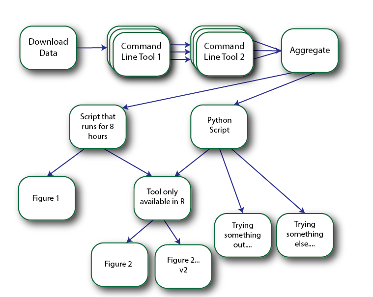
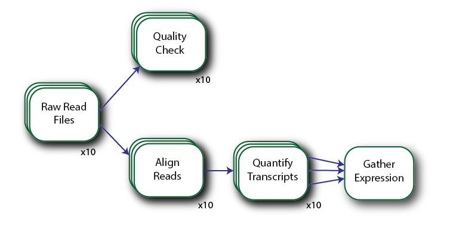
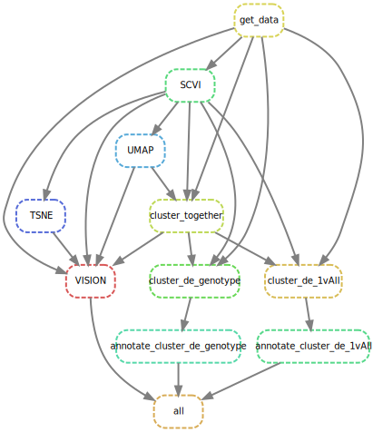

# Snakemake Tutorial

## Overview

- What does Snakemake do?
- Exploring a simple workflow
- Extending this workflow with {wildcards}
- Tour of other useful features

# What does Snakemake do?

Snakemake is a *Workflow Management System* developed specifically for data analysis pipelines.

Most data analysis projects look something like this:


Now, for a simple workflow, and if everything you need to use is in one language (e.g., Python or R), you might just put this all in one script:

```python
# Define some functions up here

# Run the analysis
raw_data = load_data()
processed_data = process_data()
create_plot1(processed_data)

clusters = cluster_data(processed_data)

for cluster in clusters:
    analyze_subset(cluster)
```

And for some projects this is just fine!  
Your workflow might look something like:

1. Create pipeline
2. Inspect results
3. Modify something
4. Repeated 2 and 3 until `graduated==True`

**This is fine**...until things become more complicated

- Data gets bigger.  Individual steps start to take a long time
- Different steps are in different languages
- Workflows become more complicated



So what do you do?  

- Split different steps into different files
- Run them in the right order
- Run each step only when needed

The problem is that this can quickly become too complicated.  It can be hard to remember what you need to re-run after you make a change.  If you're running things manually, it can be tedious to run each step - especially if you are operating on many samples.

The solution - automate it.  

This is the problem that workflow management systems are made to solve.  Probably the most well-known of these is GNU Make, which is used to compile source code.  Snakemake is heavily inspired by Make (its even in the name), but has many features *specific* for data analysis pipelines.  The other part of the name, "Snake" comes from the fact that it's developed in Python but *you don't have to write any Python to use it.*

Using Snakemake involves two components:

1) Write a 'Snakefile' which defines your workflow
2) Execute the workflow by running `snakemake`

Let's look at simple workflow to get an idea of how this works.

# Exploring a simple workflow

The workflow file can be found in [Example1/Snakefile](Example1/Snakefile).

*Our Example Workflow*


## Structure of a Rule

Let's take a look at the Snakefile.  Inside this file, each step is represented by a 'rule'.

The first two rules look like this:

```
rule download_data:
    output:
        reads="sample1.fastq.gz"
        reads="raw_data/sample1.fastq.gz"
    shell:
        """
        mkdir -p raw_data
        cd raw_data
        wget https://raw.githubusercontent.com/deto/Snakemake_Tutorial/master/misc/sample1.fastq.gz
        """

rule fastqc:
    input:
        reads=rules.download_data.output
    output:
        "fastqc/results.html"
    shell:
        """
        fastqc --outdir="fastqc" {input.reads}
        """
```

Rules generally specify:

- Inputs:  Files that the rule operates on (i.e. dependencies)
- Outputs:  Files that the rule creates
- An action: Some command to run.  This can be either:
    - BASH commands
    - Python script (*.py)
    - Inline python code
    - R script (*.R)
    - R markdown file (*.Rmd)

Inputs and outputs are used by snakemake to determine the order for which rules are to be run.  If a rule B has an input produced as an output of rule A, then rule B will be run after rule A.

## Building a Target Output

We can run this pipeline as an example.  Note, that this is only made to *resemble* a read alignment pipeline for demonstration purposes.  The fastq file is empty and the executables are fake.

To run this, first add these fake executables to your path by running `source install_fake_programs.sh` in the repository root directory.  Don't worry, this is only temporary and it will revert if you open a new terminal.

You'll also need to make sure you have Snakemake installed.  If you already have Python installed (this is the case automatically for most Linux distributions and OSX) then you can install Snakemake simply by running `pip install snakemake` in your terminal.

Now, we can run these rules by first navigating to the `Example1` directory and then executing this command (in BASH):

```
snakemake fastqc
```

Snakemake automatically looks for a rules file named `Snakefile` in the current directory (though you chould supply a different one as a command-line argument if you wanted).

Here we are telling it to create the outputs of the fastqc rule, running any other dependent rule as needed.  We'll see it run the `download_data` rule first because it creates a file that the `fastqc` rule needs.

If we run `snakemake fastqc` again, snakemake outputs 'Nothing to be done.' to show that all the necessary files have already been created and no steps need to be re-run.

If you delete the output by running `rm fastqc/results.html`, and then run `snakemake fastqc` again, now the step will be re-run.

## More details on Snakemake Rules

Looking more closely at the `fastqc` rule:

```
rule fastqc:
    input:
        reads=rules.download_data.output
    output:
        "fastqc/results.html"
    shell:
        """
        fastqc --outdir="fastqc" {input.reads}
        """
```

- There can be multiple inputs/outputs
- They can be named (using the <name>=<file> syntax), or just listed in order
- These files can be referred to in the shell command (or python/R scripts)
- You can refer to the inputs/outputs of *other* rules like is shown with the input in fastqc above

These last parts are very important as they help you adhere to the DRY (don't repeat yourself) principal.  You could just type in the file names/paths multiple times, wherever needed, but by only entering it once, and then referencing it you can later make changes without having to worry about changing all occurrences of the path.

Now, you'll notice that snakemake only runs rules that are necessary for the target rule you specify.  Because our pipeline has two outputs on separate branches (the fastqc output and the gene expression plot), I've created a rule `all` which takes both of these as input (and has no output).  This is at the end of the file and is a common convention with snakemake.

```
rule all:
    input:
        rules.plot_results.output,
        rules.fastqc.output,
```

This lets you run `snakemake all` to build everything.  If we run that now, you'll see that the rules which have been run already are not re-run because they don't need to be.

## Re-running Rules

If you make a change and need to re-run a rule, there are a few options:

(1) If you modify any file that an output depends on, and then rerun snakemake, everything downstream from that file is re-run.

For example, if we modify an output using `touch STAR/results.bam` and then run `snakemake all`, the `quantify_transcripts` and `plot_results` rules are re-run.

(2) If you modify the code behind a rule, you can force the re-run of the rule by using the `-f` flag

```
snakemake -f align_reads # forces this step to run
snakemake all # runs everything else downstream of align_reads
```

(3) If you just want to re-run everything, you can use the `-F` flag.  This forces a rule to run as well as every rule it depends on.


*Other useful commands*

* `snakemake --list` or `snakemake -l`
    * list all the rules in the file
* `snakemake --dryrun`
    * only shown what *would have been run* without running any commands
* `snakemake --reason` or `snakemake -r`
    * output *why* each rule is being run

## Script Files

One thing that makes Snakemake useful for data analysis is its native support for Python and R scripts.  Look at the `plot_results` rule from our Example1 pipeline:

```
rule plot_results:
    input:
        isoforms=rules.quantify_transcripts.output.isoforms
    output:
        plot="plots/my_plot.png"
    script: "scripts/plot_things.py"
```

Here, instead of using BASH commands, we just provide the name of a Python file.  Inside that file, we can access the rule's inputs and outputs through a `snakemake` object that gets created.

```python
in_file = snakemake.input["isoforms"]
out_file = snakemake.output["plot"]
```

The same functionality is available for R and Rmd files.

# Extending this workflow with {wildcards}

Now we're going to use Snakemake *wildcards* to scale up this workflow for many samples.

Look at the [Example2 Snakefile](Example2/Snakefile).  This file implements the following workflow:



Here multiple read files are aligned with STAR, quantified with rsem, and then the gene expression estimates are merged into a single table with an R script.

To see how wildcards work - lets look at the `align_reads` rule:

```
rule align_reads:
    input:
        read1="raw_data/{id}_R1.fastq.gz",
        read2="raw_data/{id}_R2.fastq.gz"
    output:
        "{id}/STAR/results.bam"
    shell:
        """
        STAR --genomeDir "/some/directory/to/reference" \
            --outFileNamePrefix "{wildcards.id}/STAR/results" \
            --readFilesIn {input.read1} {input.read2}
        """
```

Here, `{id}` is used as a placeholder.  This step produces a file of the form `{id}/STAR/results.bam` and it expects inputs at file paths like `raw_data/{id}_R1.fastq.gz`.  Sample (empty) input files for S1 through S10 are in the `Example2/raw_data` folder.

Now, you can't run this step with a snakemake command like before.  If you try `snakemake align_reads` you will get an error explaining that target rules can't contain wildcards.  This is because Snakemake is a "pull-based" workflow manager - you ask it to build a certain output, and it determines which steps need to run to get there.

Instead, you can run:

```
snakemake S5/STAR/results.bam
```

And Snakemake sees that the `align_reads` can produce that file.  Then it parses the wildcard expression to assign "S5" as "id", and looks for the corresponding input read files.

The `quantify_transcripts` step runs after the `align_reads` step.  So if you run:

```
snakemake S7/rsem/sample.isoforms.results
```

Snakemake parses S7 as the id, sees that `quantify_transcripts` with id=S7 needs `S7/STAR/results.bam` as an input, then sees that `align_reads` can produce that file and runs it first.

Now, you wouldn't want to actually have to type this in for every sample.  So instead, you can create a rule that takes all your outputs as an input.  We could, for example, create a rule that runs all the `quantify_transcripts` steps for S1 through S10 like this:

```
rule quantify_transcripts_all:
    input:
        "S1/rsem/sample.isoforms.results",
        "S2/rsem/sample.isoforms.results",
        "S3/rsem/sample.isoforms.results",
        "S4/rsem/sample.isoforms.results",
        "S5/rsem/sample.isoforms.results",
        "S6/rsem/sample.isoforms.results",
        "S7/rsem/sample.isoforms.results",
        "S8/rsem/sample.isoforms.results",
        "S9/rsem/sample.isoforms.results",
        "S10/rsem/sample.isoforms.results",
```

However, this is still a bit tedious. Instead, you can use the `expand` function in snakemake to make this a bit shorter.  An identical rule would be:

```
rule quantify_transcripts_all:
    input:
        expand(rules.quantify_transcripts.output.isoforms,
        id=["S1", "S2", "S3", "S4", "S5", "S6", "S7", "S8", "S9", "S10"])
```

Here the `id` in the `expand` function is used to replace the wildcard `id` in the output file for `quantify_transcripts`.  The syntax used is Python syntax.  

Now, I've typed in S1 through S10, but we can take advantage of another helper function to make this easier: `glob_wildcards`.  We can use this if we already have files whose names we can use to read off the wildcard values.  Here, we have these files in the `raw_data` directory, so we can simplify things even further like this:

```
IDs, = glob_wildcards("raw_data/{id}_R1.fastq.gz")

rule quantify_transcripts_all:
    input:
        expand(rules.quantify_transcripts.output.isoforms, id=IDs)
```

This is the best option as now we have something that could just as easily work for 100s or 1000s of input files.

## Scaling up runs with many steps

The `gather_results` step does this kind of expansion in the Example2 workflow.  We can run it as a target because its output is just a non-wildcard file.

First, lets see the execution plan with `snakemake gather_results --dryrun`

```
Job counts:
        count   jobs
        10      align_reads
        1       gather_results
        10      quantify_transcripts
        21
```

And then actually run the steps with:

```
snakemake gather_results
```

That works fine, but you may notice that everything runs one at a time even though many operations could happen in parallel for this kind of workflow.  You can tell snakemake how many jobs to run in parallel by supplying the `--jobs` argument when running it.

Let's re-run everything (using the -F flag) and specify 4 cores so things can run in parallel:

```
snakemake -F --jobs 4 gather_results
```

You'll notice that things run a lot faster!  If you specify `--jobs 10` then all the `align_reads` steps run at the same time.  However, if you specify `--jobs 20` then it isn't any faster.  Even though we have 21 jobs to run, the structure of the compute graph requires that we can't start any of the `quantify_transcripts` jobs until their corresponding `align_reads` jobs has finished.

Now, in reality, you may have some jobs that on their own run using multiple cores.  In that case, you wouldn't want to run as many of them at the same time.  You can let Snakemake know about this using the `threads` option on rules.

For example, if our `align_reads` step works better using 4 cores, we could specify that like this:

```
rule align_reads:
    input:
        read1="raw_data/{id}_R1.fastq.gz",
        read2="raw_data/{id}_R2.fastq.gz"
    output:
        "{id}/STAR/results.bam"
    threads: 4
    shell:
        """
        STAR --genomeDir "/some/directory/to/reference" \
            --outFileNamePrefix "{wildcards.id}/STAR/results" \
            --readFilesIn {input.read1} {input.read2} \
            --runThreadN {threads}
        """
```

Now, for example, if we ran our pipeline with `--jobs 8` then only two `align_reads` jobs would ever run at the same time, later in the pipeline eight `quantify_transcript` jobs could still run together.

Finally, if you are working with a compute cluster schedule (such as Torque or Slurm) you can run your workflow on the cluster by providing snakemake with this `--cluster` option.

In this mode, Snakemake wraps each job and submits it to the queue.  Jobs dependent on other jobs aren't submitted until their inputs are ready.

To get this to work, you have to provide the cluster command you would use when submitting a job (such a `qsub`) for our lab's cluster, this would look like:

```
snakemake --cluster "qsub -q yosef3 -V" -j 100 all
```

This would be a bit to type every time, but you can alias all of this (minus the target rule) to a shortcut to make things easier if you are submitting often.

# Other Useful Features

The open-source contributors of Snakemake have built out many other useful features!


**Modularity**

Inside a snakefile, you can use an `include` command to add in the rules of another workflow.  This let's you split things into multiple files for ease of use and re-useability.

You can also use the `subworkflow` command to have the *input* of a snakemake rule depend on the *output* of a rule in another workflow.  When doing this, the other worklow is run first to create the target before the rule in the current workflow is run.

For example, with our wildcard example workflow above, the final step produces `expression.txt`.  If we had a second workflow that used that file, we could indicate this like so:

```
subworkflow example2:
    workdir:
        "../path/to/otherworkflow"

rule step1:
    input:
        otherworkflow("expression.txt")
```

Here, `step1` in our new workflow will take `expression.txt` as an input.  When this step is run, Snakemake will first consult the example2 workflow and either create or update "expression.txt" as necessary.


**Protected and Temporary Files**

Output files can be marked as `protected` in the Snakefile and it will be 'locked' (write permissions removed) after creation so that it's harder to accidentally delete it.

Alternately, you can mark a file as `temp` and it will be deleted as soon as any rules that depend on it are run.  This is a good way to automatically remove intermediate files that take up lots of hard disk space.

```
rule example_rule:
    input:
        "some/file/input.txt",
    output:
        protected("my_protected_file.txt"),
        temp("my_temporary_file.txt"),
    script: "do_things.py"
```

**Piped output**

Output files can also be specified as `pipes` to avoid writing large outputs to disk.

See this example from the [Snakemake Documentation](https://snakemake.readthedocs.io/en/stable/snakefiles/rules.html#piped-output)

```
rule a:
    output:
        pipe("test.{i}.txt")
    shell:
        "for i in {{0..2}}; do echo {wildcards.i} >> {output}; done"


rule b:
    input:
        "test.{i}.txt"
    output:
        "test.{i}.out"
    shell:
        "grep {wildcards.i} < {input} > {output}"
```

**Conda**

You can run different rules in different Anaconda environments by specifying an *environment.yml* as part of the rule definition.

**Containers**

You can specify different Docker or Singularity containers for each rule.

**Remote Files and Cloud Execution**

Snakemake has provisions for accessing files inside:

* AWS S3
* Google Cloud Storage
* FTP/HTTP
* Dropbox
* [and others!](https://snakemake.readthedocs.io/en/stable/snakefiles/remote_files.html)

You can point to these files as inputs for rules and they are automatically downloaded locally and removed after they are used.

When using files in AWS or Google Cloud, this can be combined with *kubernetes* to automatically run entire workflows in the cloud.

**BASH Completion**

You can enable BASH completion for rules/targets/options by adding this to your `.bashrc`:

```
`snakemake --bash-completion`
```

**Visualization**

You can visualize your workflow with Snakemake by using the `--dag` command.  This outputs the graph of rules using the 'dot' language.  On UNIX systems, you can rending this into an image for viewing by using:

```
snakemake <rule> --dag | dot | display
```

For example:



You can also run Snakemake with the `--gui` flag and you'll get a GUI you can connect to with a web browser to monitor jobs in realtime.

**Report**

Lastly you can decorate outputs with the `report(...)` option to automatically embed plots/tables into an HTML report after running your workflow.

An example (from the Snakemake documentation) can be found [here](https://snakemake.readthedocs.io/en/stable/_downloads/0d83162f139097dbe44946d6637389bc/report.html)

