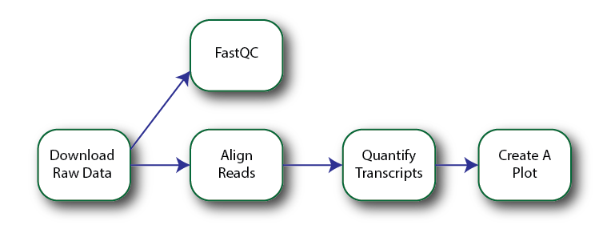

<style type="text/css" rel="stylesheet">
img + em {display: block; text-align: center;}
</style>
# Snakemake Tutorial

## Overview

- What does Snakemake do?
- Exploring a simple workflow
- Extending this workflow with {wildcards}
- Advanced Features

# What does Snakemake do?

Snakemake is a *Workflow Management System* developed specifically for data analysis pipelines.

Most data analysis projects look something like this:


Now, for a simple workflow, and if everything you need to use is in one language (e.g., Python or R), you might just put this all in one script:

```python
# Define some functions up here

# Run the analysis
raw_data = load_data()
processed_data = process_data()
create_plot1(processed_data)

clusters = cluster_data(processed_data)

for cluster in clusters:
    analyze_subset(cluster)
```

And for some projects this is just fine!  
Your workflow might look something like:

1. Create pipeline
2. Inspect results
3. Modify something
4. Repeated 2 and 3 until `graduated==True`

**This is fine**...until things become more complicated

- Data gets bigger.  Individual steps start to take a long time
- Different steps are in different languages
- Workflows become more complicated


So what do you do?  

- Split different steps into different files
- Run them in the right order
- Run each step only when needed

The problem is that this can quickly become too complicated.  It can be hard to remember what you need to re-run after you make a change.  If you're running things manually, it can be tedious to run each step - especially if you are operating on many samples.

The solution - automate it.  

This is the problem that workflow management systems are made to solve.  Probably the most well-known of these is GNU Make, which is used to compile source code.  Snakemake is heavily inspired by Make (its even in the name), but has many features *specific* for data analysis pipelines.  The other part of the name, "Snake" comes from the fact that it's developed in Python but *you don't have to write any Python to use it.*

Using Snakemake involves two components:

1) Write a 'Snakefile' which defines your workflow
2) Execute the workflow by running `snakemake`

Let's look at simple workflow to get an idea of how this works.

# Exploring a simple workflow

The workflow file can be found in [Example1/Snakefile](Example1/Snakefile).



*Our Example Workflow*

# Extending this workflow with {wildcards}

# Advanced Features
